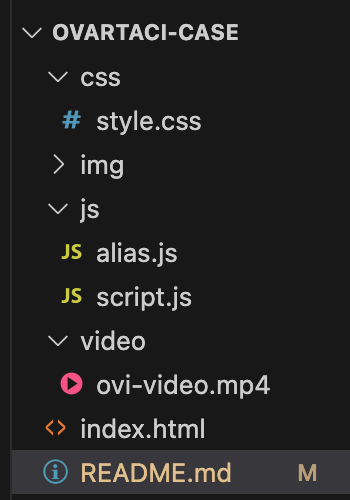
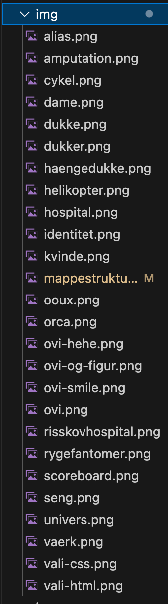

# Museum Ovartaci – Interaktiv Quizoplevelse

### Indhold i README.md

1. Projektbeskrivelse
2. Hvad er projektet er udviklet i
3. Fokusområder
4. W3C-validering
5. Mappestruktur, Strukturforklaring & Kommentarer i koden
6. Web conventions
7. OOUX og ORCA-tabel
8. JavaScript datastruktur
9. Eksempel på JavaScript-kode
10. Anvendelse af localStorage
11. Dynamisk feedback
12. GitHub-samarbejde
13. Refleksion
14. Konklusion

<br></br>

## 1. Projektbeskrivelse

Dette projekt handler om at udvikle en interaktiv digital museumsoplevelse til Museum Ovartaci.
Formålet med løsningen er at skabe mere engagement og aktiv deltagelse blandt museumsbesøgende gennem en digital quizoplevelse i det fysiske museumsrum.

Vores løsning består af en quizbaseret prototype, som skal engagere unge museumsbesøgende gennem aktiv deltagelse, læring og interaktion i det fysiske museumsrum. Brugeren guides gennem forskellige spørgsmål og får feedback undervejs. Brugeren skal blandt andet indtaste et alias, besvare quizspørgsmål og modtage dynamisk feedback baseret på deres valg.

### 2. Projektet er udviklet i:

- HTML
- CSS
- JavaScript

### 3. Fokusområder:

- Interaktionsdesign
- UX/UI
- Storytelling
- Dynamisk feedback
- localStorage
- Immersive experiences
- OOUX
- Informationsarkitektur

<br></br>

## 4. W3C-validering

Projektets HTML- og CSS-filer er begge valideret. Validering blev brugt løbende for at bla. mindske fejl.

#### index.html <p>valideret igennem: W3C HTML Validator</p>

Vi havde en enkelt fejl i vores html - hvor vi havde glemt at skrive `src`. Denne fejl er nu rettet, og der er ikke flere error beskeder tilbage.


#### style.css <p>valideret igennem: W3C CSS Validator </p>

Vi havde også en enkelt fejl i vores css - hvor vi havde kommet til at sætte et `,` istedet for et `.`. Denne fejl er nu rettet, og vi har ikke flere error beskeder tilbage.


<br></br>

## 5. Mappestruktur

<p>
  
  
  <td valign="top">
</p>

<br></br>

### Strukturforklaring

Vi har valgt denne struktur hvor hele quizen er samlet i én `index.html` med flere sektioner (screens), fordi vi syndes det gør det nemmere at styre navigationen med `js` efterfølgende.

Hver section repræsenterer en “side” i quizzen, som vises og skjules dynamisk. På den måde har vi sluppet for at skulle oprette og skifte mellem flere html-filer.

Vi har valgt at opdele `js` i 2 filer, hvor keyboardet har fået sin egen side, da vi syndes det gav et bedre overblik for os.


| Mappe/File       | Funktion                                                   |
| ---------------- | ---------------------------------------------------------- |
| **ovartaci-case**          | Rodemappe, indeholder undermapper og filer derunder. <br></br>    |
|                  |                                |
| ```index.html```   | Vores ```index.html``` er delt op i flere sections, som hver fungerer som en “skærm” i quizzen. <br></br> Den første section er forsiden, hvor brugeren kan starte quizzen. <br></br> Derefter kommer en section til alias-siden, hvor brugeren indtaster et alias. Her findes også divs til keyboard-knapperne. <br></br> Herefter kommer quiz-sectionen, som indeholder spørgsmål, billeder og svar samt en topbar med progress bar og spørgsmåls-tæller. <br></br> Dernæst er der en feedback-section, som viser om svaret er rigtigt eller forkert samt en forklaring. <br></br> Til sidst er der en score-section, hvor brugeren kan se sit resultat og scoreboard. <br></br> Alle skærme er samlet i én HTML-fil og vises/skjules dynamisk uden at skifte side. <br></br>                |
|                  |                                |
| ```css``` mappe indeholder 1 css fil        |     |
| ```style.css```  | Vores ```style.css``` bruger vi til at styre designet og layoutet på vores quizsider. <br></br> Det bruges til at gøre siderne visuelt overskuelig med farver, skrifttyper, baggrunde og placering af elementer. <br></br> Derudover bruger vi det til at vise og skjule de forskellige screens og tilføje animationer og interaktioner som fx knap-effekter og transitions. <br></br>             |
|                  |                                |  
| ```js``` mappe, indeholder 2 js filer          |   |
| ```script.js```  | ```script.js``` styrer hele quiz  funktionaliteten og er vores primær quizlogik. Den indeholder spørgsmålene, håndterer navigation mellem skærme og registrerer brugerens svar og score. <br></br> Derudover bruges ```script.js``` til at opdatere progress bar, vise feedback, gemme og hente data fra localStorage samt generere scoreboardet dynamisk.                |
| ```alias.js```   | ```alias.js``` styrer alias-siden og tastaturet. Den håndterer indtastning af tekst i inputfeltet, inklusive bogstaver, mellemrum og backspace. Derudover kan brugeren skifte mellem store og små bogstaver med shift-knappen. <br></br> Filen gør det muligt at taste på et bogstav og så kommer det frem i inputfeltet - da tasteturet skal være på en touchskærm og ikke skal bruges som et almindeligt tastatur. <br></br>              |
|                  |                                |
| `video` mappe som indeholder 1 ekelt video     |
| ovi-video.mp4   |   Video                            | 
|                                           
| ```img``` mappe som indeholder alle vores billeder       |              |
| alias.png        | Billede                        |
| baggrund.png     | Billede                        |
| forside.png      | Billede                        |
| mappestruktur.png| Billede                        |
| ooux.png         | Billede                        |
| orca.png         | Billede                        |
| ovi-hehe.png     | Billede                        |
| ovi-smile.png    | Billede                        |
| ovi.png          | Billede                        |
| scorreboard.png  | Billede                        |


    ops. der er kommet en del flere billeder til, men dette er blot for at vise strukturen.

<br></br>

### Kommentarer i koden

Vi har lavet en del kommentar i , både `html`, `css` og `js`. Kommentarne skal hjælpe os med at forstå og huske koden bedre. Kommentarne er skrevet på dansk, da vi mente det ville give mest mening for os.

<br></br>

## 6. Web conventions

Projektet følger almindelige web conventions:

- Alle filer navngives med lowercase
- Ingen danske bogstaver (æ, ø, å)
- camelCase og kebab-case bruges konsekvent
- Mapper er organiseret

<br></br>

## 7. OOUX og ORCA-tabel

Vi anvendte OOUX og ORCA-metoden til at identificere centrale objekter i løsningen.

#### OOUX - Object Mapping


#### ORCA-TABEL


<br></br>

## 8. JavaScript datastruktur

For at vise vores datastruktur har vi valgt at vise et array fra vores `script.js`- her har vi brugt et array af objekter til at gemme alle quiz-spørgsmål.

Hvert objekt indeholder spørgsmål, svarmuligheder, korrekt svar, billede og feedback.  
Datastrukturen gør det nemt at styre quizzen dynamisk i JavaScript.

(under ser man koden for de første 3 ud af 11)

```
// Alle quiz spørgsmål, svar, billeder, feedback og reflektion
const questions = [
  {
    chapter: "Identitet",
    question: "Hvad betyder navnet “Ovartaci”?",
    answers: ["Overlæge", "Overtosse", "Overkunstner"],
    correctIndex: 1,
    image: "img/ovi-hehe.png",

    // Feedback efter spørgsmålet
    feedback:
      "Navnet Ovartaci forbindes med ordet “overtosse” og blev en vigtig del af kunstnerens identitet og særlige univers.",

    // Lille refleksion til brugeren
    reflection: "Hvordan tror du et navn kan påvirke et menneskes identitet?",
  },

  {
    chapter: "Indre univers",
    question: "Hvilket tema fylder meget i Ovartacis kunst?",
    answers: ["Sport", "Identitet", "Politik"],
    correctIndex: 1,
    image: "img/identitet.png",

    feedback:
      "Identitet, fantasi og menneskesind er centrale temaer i Ovartacis kunst og fortællinger.",
  },

  {
    chapter: "Stedet",
    question: "Hvor skabte Ovartaci størstedelen af sin kunst?",
    answers: [
      "På kunstakademiet i København",
      "På Psykiatrisk Hospital i Risskov",
      "På et museum i Paris",
    ],
    correctIndex: 1,
    image: "img/risskovhospital.png",

    feedback:
      "På Psykiatrisk Hospital i Risskov skabte Ovartaci størstedelen af sine værker og udviklede sit særlige kunstneriske univers.",
  },
```

<br></br>

## 9. Eksempel på JavaScript-kode

**Hvad vil vi vise:** Denne funktion indsætter bogstav i inputfeltet dér, hvor cursoren står.

```// Indsætter tekst dér hvor cursoren står
function insertAtCursor(text) {
  const currentText = input.value;

  // Stopper hvis alias er på max længde
  if (currentText.length >= input.maxLength) return;

  const beforeCursor = currentText.slice(0, cursorPosition);
  const afterCursor = currentText.slice(cursorPosition);

  input.value = beforeCursor + text + afterCursor;
  cursorPosition += text.length;
}
```

#### Hvad går koden ud på?

1. `insertAtCursor` og tager ét input: `(text)` / det, vi vil indsætte af bogatav
2. Funktionen starter med at hente den nuværende tekst fra inputfeltet `input.value`.
3. Tjekker max længde, hvis teksten allerede er for lang (rammer max længde)
   Så stopper funktionen med `return`
4. Finder cursor-positionen, enten `beforeCursor` eller `afterCursor`
5. `input.value = beforeCursor + text + afterCursor;` betyder før cursor + ny tekst + efter cursor.
6. Opdaterer cursor-position, cursoren flyttes frem
   Fordi vi har indsat noget tekst

> **Hvilke data bruges?**
>
> - Der bruges den nuværende tekst i inputfeltet
>   `cursorPosition`
> - Den tekst brugeren trykker på `text`

> **Hvilken funktion bliver kaldt?**
>
> - Funktionen kaldes, når brugeren trykker på en tast på det virtuelle keyboard.

> **Hvordan påvirker koden HTML-siden? & Hvorfor er koden vigtig?**
>
> - Den er vigtig fordi den opdaterer inputfeltet dynamisk og placerer bogstaver korrekt, så brugeren kan skrive et alias på skærmen med et touch keyboard uden fysisk tastatur.

<br></br>

## 10. Anvendelse af localStorage

Vi har i protjektet anvendt localStorge til at gemme userens navn (alias) og dens scorre.

Et eksempel vil være til at finde i vores `script.js`:

```
function saveScore() {
  const scores = JSON.parse(localStorage.getItem("ovartaciScores")) || [];
  scores.push({
    name: playerName,
    score,
    total: questions.length,
    date: new Date().toISOString(),
  });
  scores.sort((a, b) => b.score - a.score);
  localStorage.setItem("ovartaciScores", JSON.stringify(scores.slice(0, 8)));
}
```

Funktionen `saveScore()` gemmer spillerens resultat i `localStorage`. Først hentes de tidligere scores, hvorefter den nye score tilføjes med navn, point og dato.
Derefter sorteres scorerne fra højeste til laveste, og de 8 bedste resultater gemmes, så de kan vises i scoreboardet.

<br></br>

## 11. Dynamisk feedback

Quizzen giver dynamisk feedback baseret på brugerens svar.
Feedbacken vises på en Korrekt eller Forkert side efter hver spørgsmål - så man hele tiden for feedback på hvordan man klare den.

```
// Håndterer svaret
function handleAnswer(selectedIndex) {
  const currentQuestion = questions[currentQuestionIndex];

  const isCorrect = selectedIndex === currentQuestion.correctIndex;

  // Giver point hvis svaret er korrekt
  if (isCorrect) {
    score += 1;
  }

  // Tilføjer styling til feedback screen
  screens.feedback.classList.toggle("correct", isCorrect);

  screens.feedback.classList.toggle("wrong", !isCorrect);

  // Feedback titel
  feedbackTitle.textContent = isCorrect ? "Korrekt!" : "Forkert!";

  // Forklaring
  feedbackText.textContent = currentQuestion.feedback;

  // Viser det rigtige svar
  correctAnswerText.textContent = `Rigtigt svar: ${
    currentQuestion.answers[currentQuestion.correctIndex]
  }`;

  const reflectionCard = document.querySelector(".reflection-card");

  // Viser refleksion hvis spørgsmålet har en
  if (currentQuestion.reflection) {
    reflectionCard.style.display = "block";

    reflectionText.textContent = currentQuestion.reflection;
  } else {
    reflectionCard.style.display = "none";
  }

  // Vis feedback screen
  showScreen("feedback");
}
```

<br></br>

## 12. GitHub-samarbejde

Projektet er blevet lavet igennem GitHub-samarbejde.

- Vi har begge lavedt commits løbende.
- Har den ene haft problemer med dele af koden, har det hurtigt kunne blive løst, fordi vi har lavet mange commits undervejs, som vi har kunne gå tilbage til.
- Vi har været gode til at dele tingende op, så vi begge har haft mulighed for at kode.

<br></br>

## 13. Refleksion

#### Hvorfor har vi valgt quizformat?

Vi havde mange forskællige muligheder oppe og vende, men ende med quizzen, fordi:

- Skaber aktiv deltagelse
- Understøtter læring gennem interaktion
- Kan give immediate feedback
- Passer til unge brugeres digitale vaner
- Vi tænkte det var en udfordrende opgave, som vi begge to ikke havde prøvet at kode før

Det har værert svært at kode, både fordi vi kun har værert to i gruppen med så meget viden indenfor kodning. Men også fordi det er noget vi ikke har gjordt før, så der skulle læses og forståes en del. Vi har gemt og slettet mange gange, vi har også gået tilbage til gamle commits og startet derfra igen. Det har værert udfordrende men sjovt.

<br></br>

## 14. Konklution

Vores projektet viser, hvordan en interaktiv digital løsning kan skabe mere engagement og aktiv deltagelse hos besøgende på Museum Ovartaci.
Ved hjælp af `html`, `css`, `js` og `localStorage` har vi udviklet en quizbaseret prototype med dynamisk feedback og godt brugerflow. Gennem OOUX, ORCA og UX-principper har vi skabt en løsning, der kobler storytelling og læring sammen i museummet.
